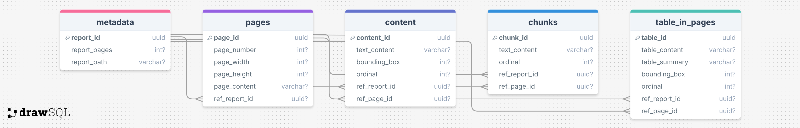

# Project for Hybrid Neural Symbolic Retrieval

  

Main contribution:

- Leverage a retrieval scheduler module to combine different retrieval methods:
  - vector-based neural retrieval
  - text-to-SQL symbolic retrieval
  - external tools, e.g., image viewer, calculator, etc.
- Treat retrieval as an **agentic** task, salient features include:
  1. Retrieval module and external tools selection
  2. Retrieval workflow orchestration, which includes:
      - decompose the original query into chain of retrievals (plan-and-solve)
      - reason upon temporary retrieval results, and determine the next action (interaction)
      - decide when to terminate (when-to-stop)
      - combine the chain-of-retrieval results (summarize-and-reflect)
  3. Plug-and-play retrieval module extension

## Documents and Tutorials

The documents for this project and fine-grained topics are discussed in the folder `documents/`. The checklist includes:

- [`documents/dataset.md`](documents/database.md):
  - dataset selection:
    - biology paper: [PDF-VQA: A New Dataset for Real-World VQA on PDF Documents](https://arxiv.org/pdf/2304.06447)
    - financial report: [TAT-DQA: Towards Complex Document Understanding By Discrete Reasoning](https://arxiv.org/pdf/2207.11871)
  - pre-processing and dataset sub-sampling scripts

  
   
  <em>Figure 1: Database Schema for Biology Paper (PDFVQA)</em>

  
   
  <em>Figure 2: Database Schema for Financial Report (TATDQA)</em>

- [`documents/database.md`](documents/database.md):
  - Folder structure of `data/database/`;
  - How to define database schema and its format (two figures above are drawn with [DrawSQL](https://drawsql.app/diagrams));
  - How to fill in database content with generic Python class `DatabasePopulation` and module `utils.functions`;
  - Scripts on creating database schema and populating database content.
- [`documents/vectorstore.md`](documents/vectorstore.md):
  - Folder structure of `data/vectorstore/`;
  - How to launch the Milvus vector database;
  - How to obtain the encoded vectors;
  - Scripts on filling in the vectorstore.
- [`documents/agent.md`](documents/agent.md):
  - Folder structure of `agents/`;
  - Different agent baselines and running scripts.
- [`documents/third_party.md`](documents/third_party_tools.md)
  - How to install and use some third-party tools (trouble-shooting guides).