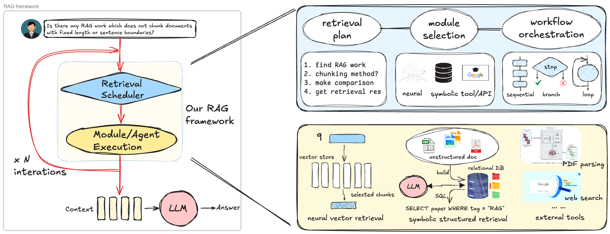
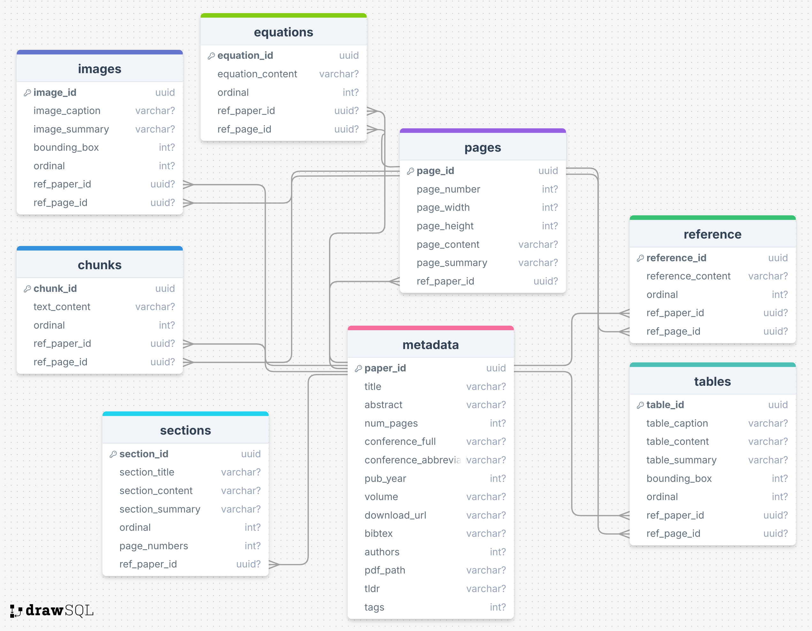

# Project for Hybrid Neural Symbolic Retrieval

<p align="center">
  
</p>

<details>
  <summary> 💫 Table of Contents (Click to expand)</summary>

- [💡 Main contributions](#-main-contributions)
- [🔍 Quick Start](#-quick-start)
- [📊 Experiment Results](#-experiment-results)
- [📖 PDF Parsing and Encoding](#-pdf-parsing-and-encoding)
- [📚 Detailed Documents and Tutorials](#-detailed-documents-and-tutorials)
- [✍🏻 Citation](#-citation)

</details>

## 💡 Main contributions
- We are the first to integrate both **vector-based neural retrieval** and **SQL-based symbolic retrieval** into a unified and interactive **NeuSym-RAG** framework through executable [actions](./agents/envs/actions/actions.json).
- We incorporate **multiple views** for parsing and vectorizing PDF documents, and adopt a [**structured database schema**](./data/database/ai_research/ai_research.sql) to systematically organize both text tokens and encoded vectors.
- Experiments on three realistic full PDF-based QA datasets w.r.t. academic research (AirQA-Real, [M3SciQA](https://github.com/yale-nlp/M3SciQA) and [SciDQA](https://github.com/yale-nlp/SciDQA)) validate the superiority over various neural and symbolic baselines.

## 🔍 Quick Start

1. Create the conda environment and install dependencies:
    - Install [`poppler`](https://pdf2image.readthedocs.io/en/latest/installation.html#installing-poppler) on your system
    - Follow the [Official Guide](https://github.com/opendatalab/MinerU) to install **MinerU** based on your OS platform
    - Check our [TroubleShooting](./documents/third_party_tools.md#mineru-installation) tips to ensure the installation of MinerU is successful
    - Install other pip requirements
    ```sh
    conda create neusymrag python=3.10
    conda activate neusymrag
    # install MinerU
    pip install -U magic-pdf[full] --extra-index-url https://wheels.myhloli.com
    # install other dependencies
    pip install -r requirements.txt
    ```
2. Prepare the following models for vector encoding:
    - [`sentence-transformers/all-MiniLM-L6-v2`](https://huggingface.co/sentence-transformers/all-MiniLM-L6-v2)
    - [`BAAI/bge-large-en-v1.5`](https://huggingface.co/BAAI/bge-large-en-v1.5)
    - [`openai/clip-vit-base-patch32`](https://huggingface.co/openai/clip-vit-base-patch32)
    - For embedding model customization, refer to [vectorstore doc](./documents/vectorstore.md)
    ```sh
    mkdir -p .cache/ && cd .cache/
    git clone https://huggingface.co/sentence-transformers/all-MiniLM-L6-v2
    git clone https://huggingface.co/BAAI/bge-large-en-v1.5
    git clone https://huggingface.co/openai/clip-vit-base-patch32
    ... # download other vector encoding models if needed
    ```
3. Download the dataset-related files into the folder `data/dataset` 👉🏻 [HuggingFace](todo)
    - `AirQA-Real`: including the `metadata/`, `papers/`, and `processed_data/`
    - `M3SciQA`: including the `metadata/`, `papers/`, `images/`, and `processed_data/`
    - `SciDQA`: including the `metadata/`, `papers/`, and `processed_data/`
  
    <details>
    <summary>Organize them into the following folder structure 👇🏻</summary>

      ```
      data/dataset/
      ├── airqa/
      │   ├── ccf_catalog.csv
      │   ├── data_format.json.template
      │   ├── metadata/ # metadata for all PDFs
      |   |   |   ├── aa0e0451-f10a-539b-9c6c-0be53800b94f.json
      |   |   |   ├── ... # more metadata for PDFs in ACL 2023
      │   ├── papers/
      |   |   ├── acl2023/
      |   |   |   ├── aa0e0451-f10a-539b-9c6c-0be53800b94f.pdf
      |   |   |   ├── ... # more PDFs in ACL 2023
      |   |   ├── iclr2024/
      |   |   |   ├── aa071344-e514-52f9-b9cf-9bea681a68c2.pdf
      |   |   |   ├── ... # more PDFs in ICLR 2024
      |   |   ├── ... # more conference + year subfolders
      │   ├── processed_data/
      |   |   |   ├── aa0e0451-f10a-539b-9c6c-0be53800b94f.json
      |   |   |   ├── ... # more processed data for PDFs in ACL 2023
      │   ├── test_data_553.jsonl # one line for each example
      │   ├── test_data_ablation.jsonl
      │   ├── uuids.json # uuids for all PDFs
      ├── m3sciqa/
      │   ├── images/
      |   |   ├── 2310.04988/
      |   |   |   ├── HVI_figure.png
      |   |   ├── ... # more image subfolders
      │   ├── metadata/
      │   ├── papers/
      │   ├── processed_data/
      │   ├── test_data.jsonl
      │   ├── mappings.json
      │   └── uuids.json
      ├── scidqa/
      │   ├── metadata/
      │   ├── papers/
      │   ├── processed_data/
      │   ├── test_data.jsonl
      │   ├── test_data_775.jsonl
      │   ├── mappings.json
      │   └── uuids.json
      └── test_pdf.pdf
      ```

    </details>

4. Download our constructed databases (`.duckdb`) and vectorstores (`.db` and `bm25.json`) into the folders `data/database/` and `data/vectorstore/`, respectively (👉🏻 [HuggingFace 🔗](TODO)). Otherwise, you can construct them by yourself (see [PDF Parsing and Encoding](#pdf-parsing-and-encoding)).
    - The 3 dataset name to database / vectorstore name mappings are:
      - `airqa -> ai_research`
      - `m3sciqa -> emnlp_papers`
      - `scidqa -> openreview_papers`

    <details><summary>Folder structures for databases and vectorstores 👇🏻</summary>

      ```txt
      data/
      ├── database/
      │   ├── ai_research/
      │   │   ├── ai_research.duckdb
      │   │   ├── ai_research.json
      │   │   ├── ai_research.sql
      │   ├── emnlp_papers/
      │   │   ├── emnlp_papers.duckdb
      │   │   ├── emnlp_papers.json
      │   │   └── emnlp_papers.sql
      │   ├── openreview_papers/
      │   │   ├── openreview_papers.duckdb
      │   │   ├── openreview_papers.json
      │   │   └── openreview_papers.sql
      ├── vectorstore/
      │   ├── milvus/ # this universal folder is for Milvus launched via Docker containers
      │   │   ├── standalone_embed.sh
      │   ├── ai_research/ # other folders are for Milvus launched standalone xxx.db
      │   │   ├── ai_research.db
      │   │   ├── bm25.json
      │   ├── emnlp_papers/
      │   │   ├── emnlp_papers.db
      │   │   ├── bm25.json
      │   ├── openreview_papers/
      │   │   ├── openreview_papers.db
      │   │   ├── bm25.json
      │   ├── filter_rules.json
      │   ├── vectorstore_schema.json
      │   ├── vectorstore_schema.json.template
      ```
      
    </details>

5. Run the following commands to compare the performance of our NeuSym-RAG framework with the Classic RAG approach: (the evaluation is also included at the end)
    - Congigure the `OPENAI_API_KEY` and `OPENAI_BASE_URL` (if needed)
    ```sh
    export OPENAI_API_KEY="sk-xxxxxxxxxxxxxxxxxxxx"
    export OPENAI_BASE_URL="https://api.openai.com/v1"
    ```
    - For more baseline methods, refer to [agents doc](./documents/agent.md)

    ```sh
    # Classic RAG baseline
    $ python scripts/classic_rag_baseline.py --dataset airqa --test_data test_data_553.jsonl --vectorstore ai_research --agent_method classic_rag
    $ python scripts/classic_rag_baseline.py --dataset m3sciqa --test_data test_data.jsonl --vectorstore emnlp_papers --agent_method classic_rag
    $ python scripts/classic_rag_baseline.py --dataset scidqa --test_data test_data_775.jsonl --vectorstore openreview_papers --agent_method classic_rag

    # NeuSym-RAG framework
    $ python scripts/hybrid_neural_symbolic_rag.py --dataset airqa --test_data test_data_553.jsonl --database ai_research --agent_method neusym_rag
    $ python scripts/hybrid_neural_symbolic_rag.py --dataset m3sciqa --test_data test_data.jsonl --database emnlp_papers --agent_method neusym_rag
    $ python scripts/hybrid_neural_symbolic_rag.py --dataset scidqa --test_data test_data_775.jsonl --database openreview_papers --agent_method neusym_rag
    ```

## 📊 Experiment Results

We compare our NeuSym-RAG with Classic-RAG on $3$ full-PDF-based academic research Q&A datasets using $5$ LLMs/VLMs:

<table>
    <tr>
        <th>Method</th>
        <th>Model</th>
        <th>Dataset AVG</th>
        <th>M3SciQA AVG</th>
        <th>SciDQA AVG</th>
    </tr>
    <tr>
        <td rowspan="5">Classic-RAG</th>
        <td>GPT-4o-mini</td>
        <td>13.4</td>
        <td>15.6</td>
        <td>59.8</td>
    </tr>
    <tr>
        <td>GPT-4V</td>
        <td>14.7</td>
        <td>11.1</td>
        <td>57.4</td>
    </tr>
    <tr>
        <td>Llama-3.3-70B-Instruct</td>
        <td>10.0</td>
        <td>11.3</td>
        <td>58.0</td>
    </tr>
    <tr>
        <td>Qwen2.5-VL-72B-Instruct</td>
        <td>10.5</td>
        <td>11.6</td>
        <td>56.2</td>
    </tr>
    <tr>
        <td>DeepSeek-R1</td>
        <td>13.9</td>
        <td>11.2</td>
        <td>62.4</td>
    </tr>
    <tr>
        <th rowspan="5">NeuSym-RAG</th>
        <td>GPT-4o-mini</td>
        <td>30.7</td>
        <td>18.0</td>
        <td>63.0</td>
    </tr>
    <tr>
        <td>GPT-4V</td>
        <td>37.3</td>
        <td>13.6</td>
        <td>63.1</td>
    </tr>
    <tr>
        <td>Llama-3.3-70B-Instruct</td>
        <td>29.3</td>
        <td><b>23.6</b></td>
        <td>56.4</td>
    </tr>
    <tr>
        <td>Qwen2.5-VL-72B-Instruct</td>
        <td><b>39.6</b></td>
        <td>21.1</td>
        <td>60.5</td>
    </tr>
    <tr>
        <td>DeepSeek-R1</td>
        <td>32.4</td>
        <td>17.4</td>
        <td><b>64.5</b></td>
    </tr>
</table>


### 📈 Evaluation

The instance-specific evaluation metric is defined in the field `evaluator` for each data sample (see [Data Format](./documents/airqa_format.md#data-format-of-airqa)). For evaluation, create a `.jsonl` file for each testing sample and store the predicted string or object in the field `answer` as well as its `uuid` like:
```jsonl
{"uuid": "00608f20-e3f5-5fdc-8979-4efeb0756d8e", "answer": "True"}
{"uuid": "00b28687-3ea1-5974-a1ec-80d7f6cd3424", "answer": "3.14"}
...
```

Then, you can run the following command to evaluate the performance:
```sh
python utils/eval_utils.py --gold data/dataset/airqa/test_data_553.jsonl --pred test_data_553_pred.jsonl --dataset airqa --output evaluation.log
```


## 📖 PDF Parsing and Encoding

Here are some useful scripts that can help you quickly parse and encode new paper PDFs into existing DB and VS. We take the dataset `airqa` (and DB / VS `ai_research`) as an example.
> **📌 NOTE:**
> - If DB and VS do not exist, they will be created automatically
> - Add the argument `--from_scratch` for any script below will delete existing ones firstly

1. **Multiview Document Parsing:** This step accepts various input types and store the parsed PDF content into the DuckDB database.
    - The default DB is `data/database/${database}/${database}.duckdb` unless you specify args `--database_path /path/to/db.duckdb`
    - The config file `ai_research_config.json` defines the pipeline functions of parsing PDFs, which can be customized according to our pre-defined [rules](./documents/database.md#database-content-population)
    ```sh
    $ python utils/database_utils.py --database ai_research --config_path configs/ai_research_config.json --pdf_path ${pdf_to_parse}
    ```

    Valid input types of args `--pdf_path ${pdf_to_parse}` include:
    1. PDF UUID: For example, `16142be2-ac28-58e5-9271-8af299b18d91`. In this case, the metadata of the PDF is pre-processed (that is `metadata/${uuid}.json` already exists, see [Metadata Format](./documents/airqa_format.md#paper-metadata-format)), and the raw PDF file has been downloaded into the `papers/subfolder/${uuid}.pdf` folder following the `pdf_path` field in the metadata.
    2. Local PDF path to the file (if the PDF file basename is a valid UUID, it reduces to the former case), e.g., `~/Downloads/2005.14165.pdf` or `data/dataset/airqa/papers/iclr2024/aa071344-e514-52f9-b9cf-9bea681a68c2.pdf`
    3. Web URL of the PDF file which is downloadable, e.g., `https://arxiv.org/abs/2005.14165`
    4. Title or arxiv id of the paper, e.g., `Language Models are Few-Shot Learners` or `2005.14165`
    5. A filepath (`.json` list or `.txt` per line) containing the list of any 4 types above, e.g., `pdfs_to_parse.json` or `pdfs_to_parse.txt`.

        ```sh
          $ cat pdfs_to_parse.json
          [
            "16142be2-ac28-58e5-9271-8af299b18d91",
            "9c5c3a63-3042-582a-9358-d0c61de3330d"
            ...
          ]
          $ cat pdfs_to_parse.txt
          16142be2-ac28-58e5-9271-8af299b18d91
          9c5c3a63-3042-582a-9358-d0c61de3330d
          ...
        ```

    > **📌 NOTE:** Sometimes, the function to obtain paper metadata via scholar APIs may fail (see [Scholar APIs](./documents/third_party_tools.md#scholar-apis)). For papers published in a conference or venue, we recommend centrally processing the metadata in advance and downloading the PDF files beforehand.

2. **Multimodal Vector Encoding:** Before vector encoding, please ensure that the PDF content has already been parsed into the corresponding DB, and the metadata `${uuid}.json` and raw file `${uuid}.pdf` already exist under the `metadata/` and `papers/` folders. Attention that:
    - **We only accept PDF UUIDs as the input PDF(s)**
    - Please ensure the embedding models exist under `.cache/` and the corresponding collection name exactly follows our [VS naming convention](./documents/vectorstore.md) defined in the [vectorstore schema](./data/vectorstore/vectorstore_schema.json)
    - Please ensure that the `bm25.json` file exists under the path `data/vectorstore/${vectorstore}/bm25.json` if you want to use BM25 collection. Otherwise, create the [BM25 vocabulary](./documents/vectorstore.md#build-bm25-vocabulary) firstly
    - The default VS is `data/vectorstore/${vectorstore}/${vectorstore}.db` unless you specify args `--vectorstore_path /path/to/vs.db`
    - The default launch method for VS is `standalone` unless you specify args like `--launch_method docker` and `--docker_uri http://127.0.0.1:19530`
    - If your OS is Windows, please follow the guide on [Run Milvus in Docker (Windows)](https://milvus.io/docs/v2.4.x/install_standalone-windows.md)

    ```sh
    # By default, using standalone mode (*.db)
    $ python utils/vectorstore_utils.py --vectorstore ai_research --pdf_path pdf_uuids_to_encode.json # --launch_method=standalone

    # Or, using Docker containers
    $ cd data/dataset/vectorstore/milvus && bash standalone_embed.sh start # start Milvus containers
    $ cd - # return to the project root
    $ python utils/vectorstore_utils.py --vectorstore ai_research --pdf_path pdf_uuids_to_encode.txt --launch_method docker --docker_uri http://127.0.0.1:19530
    $ cd data/dataset/vectorstore/milvus && bash standalone_embed.sh stop # stop Milvus containers
    ```

3. **The Complete Parsing and Encoding Pipeline:** If you want to parse and encode new PDFs in one step, use the following command:
    - Please ensure that `database` and `vectorstore` names are the same
    - `pdf_path` and `config_path`: these arguments are the same with those in **Multiview Document Parsing**
    - If you want to launch the vectorstore via Docker containers, see **Multimodal Vector Encoding**

    ```sh
    python utils/data_population.py --database ai_researh --vectorstore ai_research --pdf_path pdfs.json --config_path configs/ai_research_config.json
    ```

> **💡 TIP:**
> - If you want to accelerate or parallelize the parsing and encoding process, please refer to ....
> - If you want to customize your own papers collection, database, and vectorstore, please refer to [customization doc](./documents/customization.md).


## 📚 Detailed Documents and Tutorials

Fine-grained documents in this project are detailed in `documents/`. Here is the checklist:

- [`documents/dataset.md`](documents/dataset.md):
  - The source of the datasets we use and convert in this project;
  - Where to download the datasets and resources.
- [`documents/database.md`](documents/database.md):
  - Folder structure of `data/database/`;
  - How to define database schema and its format;
  - How to fill in database content with generic Python class `DatabasePopulation` and module `utils.functions`;
  - Scripts of creating database schema and populating database content.
<p align="center">
  
  <br>
  <em>An Illustration of Database Schema for AI Research Papers</em>
</p>

- [`documents/vectorstore.md`](documents/vectorstore.md):
  - Folder structure of `data/vectorstore/`;
  - How to launch the Milvus vector database;
  - How to obtain the encoded vectors;
  - Scripts on filling in the vectorstore.
- [`documents/agent.md`](documents/agent.md):
  - Folder structure of `agents/`;
  - Different agent baselines and running scripts.
- [`documents/third_party.md`](documents/third_party_tools.md)
  - How to install and use some third-party tools


## ✍🏻 Citation

If you find this project useful, please cite our work:
```txt
{
  "TO BE RELEASED"
}
```