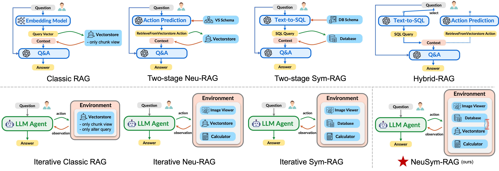

# Agent Baselines


## Folder Structure

<details><summary>👇🏻 Click to preview the <code>agents</code> module</summary>

```txt
agents/
├── envs/
│   ├── __init__.py
│   ├── actions/
│   │   ├── __init__.py
│   │   ├── action.py
│   │   ├── actions.json
│   │   ├── calculate_expr.py
│   │   ├── classic_retrieve.py
│   │   ├── error_action.py
│   │   ├── generate_answer.py
│   │   ├── observation.py
│   │   ├── retrieve_from_database.py
│   │   ├── retrieve_from_vectorstore.py
│   │   └── view_image.py
│   ├── classic_env.py
│   ├── env_base.py
│   ├── graph_env.py
│   ├── hybrid_env.py
│   ├── neural_env.py
│   └── symbolic_env.py
├── frameworks/
│   ├── __init__.py
│   ├── agent_base.py
│   ├── classic_rag_agent.py
│   ├── iterative_classic_rag_agent.py
│   ├── iterative_neu_rag_agent.py
│   ├── iterative_sym_rag_agent.py
│   ├── neusym_rag_agent.py
│   ├── trivial_baseline.py
│   ├── two_stage_hybrid_rag_agent.py
│   ├── two_stage_neu_rag_agent.py
│   └── two_stage_sym_rag_agent.py
├── models/
│   ├── __init__.py
│   ├── llm_base.py
│   ├── llm_cache.py
│   ├── llm_gpt.py
│   └── llm_vllm.py
└── prompts/
    ├── __init__.py
    ├── agent_prompt.py
    ├── hint_prompt.py
    ├── schema_prompt.py
    ├── system_prompt.py
    └── task_prompt.py
```

</details>

The entire `agents` package can be splitted into 4 sub-modules:
- 🌏 `envs`: responsible for `gym`-like environments and action/observation space management (e.g., action specification, action parsing, serialization to messages, and execution upon the backend)
- 📭 `models`: responsible for calling LLMs. We implement the unified interface for both closed-source ([`GPTClient`](../agents/models/llm_gpt.py)) and open-source LLMs ([`VLLMClient`](../agents/models/llm_vllm.py)), along with a SQLite cache ([`Sqlite3CacheProvider`](../agents/models/llm_cache.py)) to store historical responses
- 📜 `prompts`: responsible for different prompt templates, e.g., system, agent, task, schema and hint prompts.
- ⛩️ `frameworks`: responsible for different agentic frameworks. Each baseline method inherits from the base `AgentBase` class and implements the `interact` function.


## Overview of Agent Baselines

<p align="center">
  
  <br>
  <em>The Comparison of Different Agent Baselines</em>
</p>

Here is the checklist of all different agent baselines:

| method name                    | neural | symbolic | multi-view | multi-turn | agent method |
|:------------------------------ |:----:|:----:|:----:|:----:|:----|
| Trivial: question only         | ❌ | ❌ | ❌ | ❌ | [`trivial_question_only`](../scripts/trivial_question_only_baseline.py) |
| Trivial: title + abstract      | ❌ | ❌ | ❌ | ❌ | [`trivial_title_with_abstract`](../scripts/trivial_title_with_abstract_baseline.py) |
| Trivial: full-text with cutoff | ❌ | ❌ | ❌ | ❌ | [`trivial_full_text_with_cutoff`](../scripts/trivial_full_text_with_cutoff_baseline.py) |
| Classic-RAG                    | ✅ | ❌ | ❌ | ❌ | [`classic_rag`](../scripts/classic_rag_baseline.py) |
| Iterative Classic-RAG          | ✅ | ❌ | ❌ | ✅ | [`iterative_classic_rag`](../scripts/iterative_classic_rag_baseline.py) |
| Two-stage Neu-RAG              | ✅ | ❌ | ✅ | ❌ | [`two_stage_neu_rag`](../scripts/two_stage_neu_rag_baseline.py) |
| Iterative Neu-RAG              | ✅ | ❌ | ✅ | ✅ | [`iterative_neu_rag`](../scripts/iterative_neu_rag_baseline.py) |
| Two-stage Sym-RAG              | ❌ | ✅ | ✅ | ❌ | [`two_stage_sym_rag`](../scripts/two_stage_sym_rag_baseline.py) |
| Iterative Sym-RAG              | ❌ | ✅ | ✅ | ✅ | [`iterative_sym_rag`](../scripts/iterative_sym_rag_baseline.py) |
| Two-stage Graph-RAG            | ✅ | ❌ | ✅ | ❌ | [`two_stage_graph_rag`](../scripts/two_stage_graph_rag_baseline.py) |
| Iterative Graph-RAG            | ✅ | ❌ | ✅ | ✅ | [`iterative_graph_rag`](../scripts/iterative_graph_rag_baseline.py) |
| Two-stage Hybrid-RAG           | ✅ | ✅ | ✅ | ❌ | [`two_stage_hybrid_rag`](../scripts/two_stage_hybrid_rag_baseline.py) |
| **NeuSym-RAG**                 | ✅ | ✅ | ✅ | ✅ | [`neusym_rag`](../scripts/hybrid_neural_symbolic_rag.py) |

> **❗️ Note:** Code for Two-stage Graph-RAG and Iterative Graph-RAG are preparing.


## Usage

- All dataset and database/vectorstore names are:

    | Dataset    | Dataset Name  | Database Name       | Vectorstore Name    |
    |:----------:|:-------------:|:-------------------:|:-------------------:|
    | AirQA-Real | `airqa`       | `ai_research`       | `ai_research`       |
    | M3SciQA    | `m3sciqa`     | `emnlp_papers`      | `emnlp_papers`      |
    | SciDQA     | `scidqa`      | `openreview_papers` | `openreview_papers` |

- We take the dataset `airqa` and database/vectorstore `ai_research` as an example:
    - Before running, please set the environment variable `OPENAI_API_KEY` to your OpenAI API key
    - If you want to use open-source LLMs (e.g., `‑‑llm qwen2.5-vl-72b-instruct`) launched with vLLM, please set the environment variable like:

        ```sh
        export VLLM_API_KEY="EMPTY"
        export VLLM_BASE_URL="http://localhost:8000/v1/"
        # export VLLM_EMBED_BASE_URL="http://localhost:8001/v1/" # for Graph-RAG methods
        ```

    - For other agent baselines, please use the corresponding [agent method](#overview-of-agent-baselines)

```sh
# NeuSym-RAG framework
python scripts/hybrid_neural_symbolic_rag.py --dataset airqa --test_data test_data_553.jsonl \
    --database ai_research --vectorstore ai_research --agent_method neusym_rag \
    --llm gpt-4o-mini --max_turn 20 # ... optional arguments, see below

# Other agent baseline methods
agent_method=classic_rag # trivial_question_only, iterative_neu_rag, two_stage_hybrid_rag, etc.
python scripts/${agent_method}_baseline.py --dataset airqa --test_data test_data_553.jsonl \
    --database ai_research --vectorstore ai_research --agent_method ${agent_method} \
    --llm gpt-4o-mini # ... optional arguments, see below
```

> **❗️ NOTE:** For `two_stage_graph_rag` and `iterative_graph_rag`, the main body is the invocation of the official [GraphRAG](https://microsoft.github.io/graphrag/) script. Currently, we only support that the LLM (`--llm`) and embedding model (`--graphrag_embed`)  are both models from the OpenAI API base, or both from the vLLM API. If local servers are used, please also set the environment variable `VLLM_EMBED_BASE_URL` (e.g., `VLLM_EMBED_BASE_URL="http://localhost:8001/v1/"`) to the launched embedding server.
> **⭐️ TIP:** For different datasets, we set the default graphrag root to `data/graph/${dataset}/`. This folder can be changed by modifying the function `get_graphrag_root` in [`utils/config.py`](../utils/config.py).


## Optional Arguments

For all arguments below, they apply to all agent baselines (see [`utils/hyperparam_utils.py`](../utils/hyperparam_utils.py)).

### Input / Output Arguments

| Argument             | Default Value | Description               |
|:---------------------|:--------------|:--------------------------|
| `‑‑test_data`        | test_data.jsonl | The test data file in `.jsonl` format.      |
| `‑‑result_dir`       | results/        | Which folder to record the log and results. |
| `‑‑database_path`    | data/database/${database}.duckdb          | Specify the DuckDB path of the `.duckdb` file. |
| `‑‑vectorstore_path` | data/vectorstore/${vectorstore}.db        | Specify the Milvus VS path of the `.db` file if the launch_method is `standalone`. |
| `‑‑launch_method`    | standalone                                | How to launch the Milvus vectorstore. Choices: `['standalone', 'docker']` |
| `‑‑docker_uri`       | 127.0.0.1:19530                           | The URI of the Milvus server if the launch_method is `docker`. |


### Method Arguments

| Argument              | Default Value | Description |
|:----------------------|:--------------|:------------|
| `‑‑cutoff`            | 5             | The maximum number of tokens (x 1000) for input text context. For agent method `trivial_title_with_abstract` and `trivial_full_text_with_cutoff`. |
| `‑‑collection_name`   | text_sentence_transformers_all_minilm_l6_v2 | The collection name of the Milvus vectorstore. By default, use sentence-transformers/all-MiniLM-L6-v2. For agent method `classic_rag` and `iterative_classic_rag`. |
| `‑‑table_name`        | chunks        | The table name (which chunking view) to retrieve. For agent method `classic_rag` and `iterative_classic_rag`. |
| `‑‑column_name`       | text_content  | The column name (which chunking view) to retrieve. For agent method `classic_rag` and `iterative_classic_rag`. |
| `‑‑limit`             | 4             | The number of chunks to retrieve from the VS. Only used for agent method `classic_rag`. |
| `‑‑graphrag_method`   | local         | The retrieval method for agent method `two_stage_graph_rag` and `iterative_graph_rag`. Choices: `['local', 'global']`. |
| `--graphrag_embed`    | text-embedding-3-small | The embedding model name for Graph-RAG methods `two_stage_graph_rag` and `iterative_graph_rag`. |


### Prompt Arguments

| Argument              | Default Value | Description |
|:----------------------|:--------------|:------------|
| `‑‑action_format`     | markdown      | The format of the serialized action. Choices: `['json', 'markdown', 'xml', 'yaml']` |
| `‑‑output_format`     | json          | The format of the output observation. Choices: `['markdown', 'json', 'html', 'string']`. It will affect the [`RetrieveFromDatabase`](../agents/envs/actions/retrieve_from_database.py) and [`RetrieveFromVectorstore`](../agents/envs/actions/retrieve_from_vectorstore.py) actions. |
| `‑‑db_format`         | create_sql    | How to serialize the database schema. Choices: `['create_sql', 'detailed_json']`. |
| `‑‑vs_format`         | detailed_json | How to serialize the vectorstore schema. Currently, only `detailed_json` is supported. |
| `‑‑interact_protocol` | react         | How to extract the action text from raw LLM responses. Choices: `['react', 'code_block']`. Currently, this field is fixed. For Iterative Classic-RAG/Neu-RAG/Sym-RAG and NeuSym-RAG, it must be `react`, while `code_block` for the others. |
| `‑‑window_size`      | 5             | The history trajectory size of the sliding window for iterative agent methods. |
| `‑‑max_turn`         | 20            | The maximum number of turns in the interaction. |


### LLM Arguments

| Argument              | Default Value | Description |
|:----------------------|:--------------|:------------|
| `‑‑llm`               | gpt-4o-mini   | The LLM model name to use.  |
| `‑‑temperature`       | 0.7           | The temperature of the LLM. |
| `‑‑top_p`             | 0.95          | The top-p of the LLM.       |
| `‑‑max_tokens`        | 1500          | The maximum number of tokens to generate each turn. |
| `‑‑image_limit`      | 10            | The maximum number of images which can be inserted into messages. For non-VLLMs, set it to $0$. |
| `‑‑length_limit`     | 32            | The maximum number of tokens (x 1000, prompt + completion).           |
