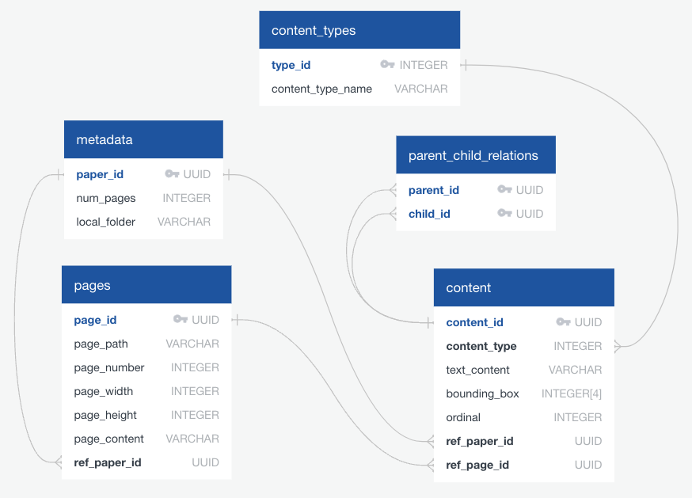

# Database

The database folder should be organized into the following structure under `data/database`, with each database assigned a separate folder. The utility functions are provided in path `utils/database_utils.py` and we use [DuckDB](https://duckdb.org/) for efficiency and simplicity.
```txt
- data/
    - database/
        - financial_report/
            - financial_report.json
            - financial_report.sql
            - financial_report.duckdb
        - biology_paper/
            - biology_paper.json
            - biology_paper.sql
            - biology_paper.duckdb
        - ... other databases ...
```

Under each database folder, it at least contains the following three files:
- `{database_name}.json`: the database schema file
- `{database_name}.sql`: SQL CREATE statement to build the database
- `{database_name}.duckdb`: the DuckDB file which stores the cell content
- please use consistent, lowercased and underscore splitted (pythonic) naming convention to name your database

## Quick Reference: Commands

1. [**Create**] Build database from `.json` schema file:
- add args `--from_scratch` will automatically delete existing `.duckdb` file
```sh
python utils/database_utils.py --database financial_report --function create_db --from_scratch
python utils/database_utils.py --database biology_paper --function create_db --from_scratch
python utils/database_utils.py --database ai_research --function create_db --from_scratch
```
2. [**Populate**] Parse PDF content and write into database:
- by default, writing strategy is `--on_conflict replace`. It means when writing rows whose primary key already exists in DB, the value will be updated without raising error. This value can be changed to `raise`, `ignore`.
```sh
python utils/database_utils.py --database biology_paper --pdf_path data/dataset/pdfvqa/processed_data/pdf_data.jsonl --config_path configs/biology_paper_config.json --function populate_db --on_conflict replace
python utils/database_utils.py --database financial_report --pdf_path data/dataset/tatdqa/processed_data/pdf_data.jsonl --config_path configs/financial_report_config.json --function populate_db --on_conflict replace
```


## Database Schema File

The database schema file is structured as: (for better readability and ease of design/revision, but may not be efficient for programming and retrieving)
```json
{
    "database_name": "which should be the basename of the schema file",
    "description": "A natural language description about this database",
    "database_schema": [ // a List of table-columns dicts
        {
            "table": {
                "table_name": "readable_name_for_this_table",
                "description": "A natural language description about this table, e.g., what it contains and its functionality."
            },
            "columns": [
                {
                    "column_name": "readable_name_for_this_column",
                    // refer to official doc: https://duckdb.org/docs/sql/data_types/overview, e.g., FLOAT, INTEGER[], MAP(INTEGER, VARCHAR)
                    "column_type": "upper_cased_data_type_string_of_DuckDB",
                    "description": "A natural language description about this column, e.g., what is it about.",
                },
                {
                    ... // other columns
                }
            ],
            "primary_keys": [
                "column_name",
                "composite_primary_key_column_name" // composite primary keys
            ], 
            "foreign_keys": [
                // List of triplets, allow composite foreign keys, e.g., ["stuname", "student", "student_name"], [["stuname", "stuclass"], "student", ["student_name", "class_name"]]
                ["current_column_name_or_column_name_list", "reference_table_name", "reference_column_name_or_column_name_list"],
                ... // other foreign keys
            ]
        },
        {
            ... // other tables
        }
    ]
}
```

- For the complete available data types, please refer to [DuckDB Data Types](https://duckdb.org/docs/sql/data_types/overview). Here are some basic types you should prioritize and use for the json field `column_type`:
    - basic types:
        - `BOOLEAN`: boolean value, true/false;
        - `INTEGER`: int4;
        - `FLOAT`: float4;
        - `DOUBLE`: float8, please use `FLOAT` with priority;
        - `DATE`: date type, containing year, month, and day, usually in the format `YYYY-MM-DD`, e.g., `2024-08-08`;
        - `TIME`: time type, containing hour, minute, and second, usually in the format `HH:MM:SS`, e.g., `22:00:00`;
        - `DATETIME`: including both `DATE` and `TIME` (alias of `TIMESTAMP`, either type is ok), usually in the format `YYYY-MM-DD HH:MM:SS`, e.g., `2024-08-08 22:00:00`;
        - `TIMESTAMPTZ`: timestamp with time zone information, usually in the format `YYYY-MM-DD HH:MM:SS±HH:MM`, e.g., `2024-08-11 14:30:00+02:00` represents August 11, 2024, at 14:30 in a time zone that is 2 hours ahead of UTC;
        - `VARCHAR`: actually, this is an alias of `STRING`, `CHAR` and `TEXT`. Please use `VARCHAR` for consistency;
        - `UUID`: only used as primary keys, can be converted or interpreted as `VARCHAR`.
    - advanced types:
        - there are some advanced and structured data types such as `ARRAY`, `LIST`, `MAP`, `STRUCT`, and `UNION`. Please refer to the [official document](https://duckdb.org/docs/sql/data_types/overview#nested--composite-types) for use cases;
        - when specifying these advanced column types, you should pay attention to the format when filling the `column_types` field, e.g., `INTEGER[3]` for `ARRAY`, `INTEGER[]` for `LIST`, and `MAP(INTEGER, VARCHAR)` for `MAP`.


## CREATE Database

Given the `.json` file, we can invoke function in `utils/database_util.py` to automatically generate the `CREATE` SQL statement and execute it to create the database, and write the corresponding `.sql` CREATE statement and the resulting `.duckdb` file into the same folder.
- argument `--from_scratch` will delete local database first to avoid any conflict

```pyhton
python utils/database_utils.py --database financial_report --function create_db --from_scratch
python utils/database_utils.py --database biology_paper --function create_db --from_scratch
```

### Database Schema Visualization

After running the `create_db` script above, we will get the `.sql` DDL file under database folder. We can use free online tools (e.g., [DrawSQL](https://drawsql.app/diagrams)) to import this DDL file and obtain the visualization graph (choose `PostgreSQL` as the database type). For example:

<p align="center">
  
  <br>
  <em>Database Schema for Biology Paper (PDFVQA)</em>
</p>


## Database Content Completion

To populate the database content given an input PDF file, we may utilize various database- or domain-specific functions to extract certain cell values. Thus, we propose a [`DatabasePopulation`](../utils/database_population.py) framework to formalize the data flow or processing pipeline. The entrance function for this class is `populate`:

```python
def populate(self, pdf_path: str, config: Dict[str, Any], log: bool = True, on_conflict: str = 'replace') -> None:
    """ Given a path to the PDF file (`pdf_path`), try to parse the raw PDF according to the pipeline defined in `config` and insert values into the corresponding database based on the conflicting policy `on_conflict`. If `log = True`, also write the INSERT SQL statement into log files.
    """
    pass
```

The essence is how to formalize the `config` dict. Take a small testing database `test_domain` as an example:
- The database schema and `.duckdb` file is stored in the folder `data/database/test_domain/`;

```sh
python utils/database_utils.py --database test_domain --function create_db
```

- The JSON dict (`config`) for this database is located in `configs/test_domain_config.json`. You can store your personal config file in the path `configs/{database_name}_config.json`. The `config` dict contains two JSON keys, `pipeline` and `aggregation`, where:
    - `pipeline` defines the procedure of obtaining values for different columns;
    - `aggregation` indicates how to aggregate the output of all pipeline functions into row entries for each table.

```json
{
    "pipeline": [
        {
            "function": "get_pdf_page_text",
            "args": {
                "deps": [
                    "pdf_path"
                ],
                "kwargs": {
                    "generate_uuid": true,
                    "normalize_blank": true
                }
            }
        },
        {
            "function": "get_text_summary",
            "args": {
                "deps": [
                    "get_pdf_page_text"
                ],
                "kwargs": {
                    "key": "page_contents",
                    "max_length": 50,
                    "model": "gpt-4o",
                    "temperature": 0.7
                }
            }
        }
    ],
    "aggregation": [
        {
            "function": "aggregate_test_domain_table_pdf_meta",
            "table": "pdf_meta",
            "columns": ["pdf_id", "pdf_name", "pdf_path"],
            "args": {
                "deps": [
                    "get_pdf_page_text"
                ],
                "kwargs": {}
            }
        },
        {
            "function": "aggregate_test_domain_table_pdf_pages",
            "table": "pdf_pages",
            "args": {
                "deps": [
                    "get_pdf_page_text",
                    "get_text_summary"
                ],
                "kwargs": {}
            }
        }
    ]
}
```

1. **Extract cell values:** For the first function dict in the field `pipeline`,
```python
{
    "function": "get_pdf_page_text",
    "args": {
        "deps": [
            "pdf_path"
        ],
        "kwargs": {
            "generate_uuid": true,
            "normalize_blank": true
        }
    }
}
```
where `deps = ["pdf_path"]` means we use exactly the parameter `pdf_path` as the first position argument for function `get_pdf_page_text`. For the second pipeline function, `deps = ["get_pdf_page_text"]` means `get_text_summary` takes the output of the first function `get_pdf_page_text` as the first input argument. For other keyword arguments, you can directly pass it into the `kwargs` dict.

> **Best Practices and FAQ:**
> - _Where can I define my personal functions?_ In the module `utils/functions/`, and remember to import them in `utils/functions/__init__.py`.
> - _How do I name my function?_ It totally depends on yourself. Try to be straightforward and avoid duplication. You can follow some convention like always starting with the prefix `get_xxxx`.
> - _Obligation:_ The first pipeline function **MUST** take `pdf_path` as one of its position argument.
> - _Suggestion:_ If your pipeline function is universal or can be shared across different databases, consider putting it in a generic `.py` file like `common_functions.py` or `pdf_functions.py`. Otherwise, create a separate `{database_name}.py` file in the `functions/` folder.
> - _Suggestion:_ For the output of each pipeline function, consider using a JSON dict `-> Dict[str, Any]` as the **output type**, such that it will be easier to chain the function pipeline.


2. **Aggregate cell values**: Each column value may be processed in distinct pipeline functions, we need some method to combine them together into a single table. This is exactly what the `aggregation` dict list does. For example,
```json
{
    "function": "aggregate_test_domain_table_pdf_meta",
    "table": "pdf_meta",
    "columns": ["pdf_id", "pdf_name", "pdf_path"],
    "args": {
        "deps": [
            "get_pdf_page_text"
        ],
        "kwargs": {}
    }
}
```
It takes almost the same format as `pipeline` functions (`deps` for input-output dependencies and `kwargs` for positional arguments), except two special fields:
1. `table` which denotes the table name to insert values;
2. `columns` which represents the list of column names in `table` to be inserted. This field can be omitted, and by default will insert values for all columns in the current `table` [suggested];
Note that, `deps` indexes the output of `pipeline` functions instead of `aggregation` functions.

> **Best Practices and FAQ:**
> - _Where should I put the aggregate function?_ In most cases, you should put it in a separate `utils/functions/{database_name}.py` for the current database, because this function can be hardly re-used by other domains.
> - _How do I name the function?_ One suggestion is to name your function based on the database and the table to be populated, e.g., `aggregate_{database_name}_table_{table_name}`.
> - _What should be the output format?_ The output **MUST BE** of the type `List[List[Any]]`, such that the follow-up function `insert_values_to_database` in our population framework can automatically create the `INSERT` SQL statements and execute them.
> - _Suggestion:_ About the data type transformation between Python and SQL, see official document for [Conversion between Python types and DuckDB data types](https://duckdb.org/docs/api/python/conversion).


### Usage

Take the two datasets as example, all PDFs in `pdf_data.jsonl` will be parsed and populated into their corresponding databases via:
```sh
python utils/database_utils.py --database biology_paper --pdf_path data/dataset/pdfvqa/processed_data/pdf_data.jsonl --config_path configs/biology_paper_config.json --function populate_db --on_conflict replace
python utils/database_utils.py --database financial_report --pdf_path data/dataset/tatdqa/processed_data/pdf_data.jsonl --config_path configs/financial_report_config.json --function populate_db --on_conflict replace
python utils/database_utils.py --database ai_research --pdf_path data/dataset/airqa/sample_pdf_data.jsonl --config_path configs/ai_research_config.json --function populate_db --on_conflict replace
```